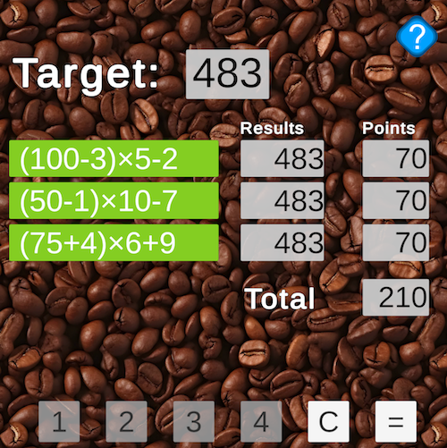

# Introduction

<table>
<tbody>
<tr>
  <td>
  <td valign="top">14Numbers is a puzzle game in which everyone in the world is trying to solve the same puzzle. There is a new puzzle each day.  You have 14 numbers and need to come up with three equations to solve for the daily target number.</td>
  </td>
</tr>
</tbody>
</table>

# NFTs

<table>
<tbody>
<tr>
  <td valign="top"><a href="./14numbers/nfts.md">Gen1 NFTs</a> will be released in April, 2025. This first release has four NFTs: Golden Fans, Bright Cats, Fantasy Flowers, and Yellow Flowers.</td>
  <td>
  </td>
</tr>
</tbody>
</table>

# Roadmap

The roadmap for 14Numbers (as of mid-February 2025) is:

* Android support
* Improve experience for tablets.
* Handle failure cases:
  * Handle no-network situations when phone has no connection to the internet.
  * Handle not-logged in for publishing and checkin.
* Improve screens:
  * Implement setup screen: time zone.
  * Make open splash screen slicker
  * Rework Stats screen
  * Rework Credits screen
* NFT support: 
  * Deploy ERC1155 NFT contract.
  * Mint Series 1 NFTs
  * NFT integration
  * NFT claiming contract
  * NFT claiming flow in app
  * Mint Series 2 NFTs and set them up for claiming
  * Set-up Token Trove support
* Passport Play Game page
  * Implement Passport screen, linking to the Passport page.

